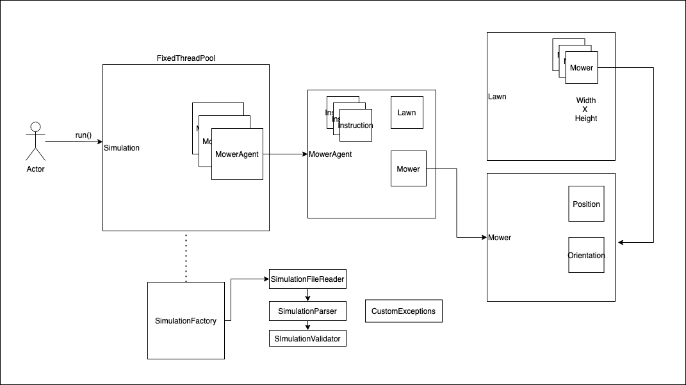

# mower

## Used technologies

    Java - JDK 11
    Maven
    Travis
       
   Tests: [JUnit 5](https://junit.org/junit5/)
   
   Test Driven Development: [TDD](https://en.wikipedia.org/wiki/Test-driven_development)
    
## Installation

    git clone https://github.com/saidbouig/mower.git
    cd mower
    mvn clean install
    
## Run
    
    java -jar ./target/mower-1.0-SNAPSHOT.jar <full_path_to_input_file>
    
### Input example

    5 5
    1 2 N
    LFLFLFLFF
    3 3 E
    FFRFFRFRRF

### Expected output

    1 3 N
    5 1 E

## Mower Design

